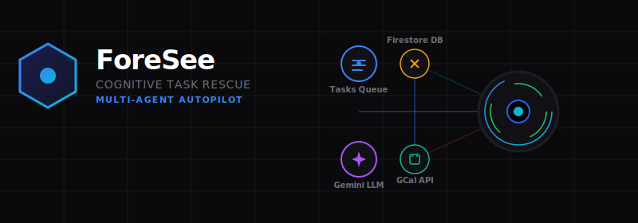

<div align="center">
  
  

  <br />

  <h1>🚀 ForeSee</h1>
  <h3><i>Cognitive-Aware Agentic Task Scheduler & Timeline Rescue Engine</i></h3>

  <p>
    <b>Predict deadline failure probabilities, group task cognitive loads, and autonomously rescue schedules before they slip.</b>
  </p>

  <!-- Badges -->
  <p>
    <a href="https://github.com/krishnasahoo11156/foresee"></a>
    <a href="https://github.com/krishnasahoo11156/foresee"></a>
    <a href="https://github.com/krishnasahoo11156/foresee/blob/main/LICENSE"></a>
  </p>

  <p>
    <a href="#-problem-statement">Problem Statement</a> •
    <a href="#-solution-overview">Solution Overview</a> •
    <a href="#-key-features">Key Features</a> •
    <a href="#-google-technologies-utilized">Google Tech</a> •
    <a href="#-quick-start">Quick Start</a>
  </p>
</div>

---

## 🎯 Problem Statement
Knowledge workers plan tasks daily, yet **70% of software projects miss their deadlines**. The root cause is not lack of effort; it is that existing productivity tools are **completely static**:
- **Context-switching is invisible**: Moving from deep coding to a status meeting incurs a verified 23-minute cognitive re-focus cost. Traditional calendars ignore this completely.
- **Deadline risk is binary**: Tools only notify you *after* a deadline has passed, rather than predicting risk beforehand.
- **No autonomous correction**: When a timeline slips, the user has to manually reschedule, resolve calendar overlaps, and adjust plans.

---

## 💡 Solution Overview
**ForeSee** is a cognitive-aware, agentic task scheduler and timeline rescue engine. It acts as an always-on AI co-pilot that monitors task queues, calendar workloads, and user-onboarded cognitive parameters in real time. 

Powered by **Gemini 1.5 Flash**, ForeSee:
1. Decomposes large tasks into structured focus blocks.
2. Groups cognitively adjacent work to minimize attention switching costs.
3. Continuously evaluates deadline risk scores using a multi-variable engine.
4. Generates and autonomously executes rescue strategies (Focused Sprint, Scope Compression, Emergency Reschedule) to keep critical tasks on track, syncing changes back to **Google Calendar** in real time.

---

## ✨ Key Features

- **📊 Dynamic Risk Scoring Engine** — Computes a live 0–100 risk factor per task based on daily capacity, remaining workload, deadline proximity, and focus alignment.
- **🤖 Gemini-Powered Copilot Chat** — An interactive chat terminal that decomposes user prompts into tasks, drafts focus schedules, and suggests events that sync in one click.
- **⚡ Autonomous Rescue Planner** — Automatically activates when a task crosses into Danger or Critical state, offering three alternate paths and auto-updating schedules.
- **🎰 Monte Carlo Simulator** — Runs 500 probabilistic timeline runs to predict the distribution of likely completion dates.
- **👁️ Multi-Agent Orchestration Visualizer** — Live animated pipeline illustrating sequence flows between four background agents: *Security Validator*, *Scheduling Optimizer*, *Firebase Sync*, and *Notification Dispatcher*.
- **📈 Cognitive Load Simulator** — Visualizes focus intensity and simulated switcher fatigue using interactive spline-curve charts.
- **⚙️ Settings HUD** — Futuristic SVG arc-gauge dials for calibrating Focus Bandwidth, Autonomy levels, and Context Costs to customize risk profiles.
- **👤 Full Guest Mode Bypass** — Seeding of realistic task lists, schedules, and chat history for evaluators to test all actions instantly without logging in.

---

## 🛠️ Technologies Used

| Layer | Technology |
|---|---|
| **Frontend** | Next.js 14 (App Router), React 18, TypeScript |
| **Styling** | Vanilla CSS, system theme tokens, CSS custom properties |
| **Database** | Firebase Firestore (Real-time `onSnapshot` subscriptions) |
| **Authentication** | Firebase Authentication (Google OAuth 2.0) |
| **AI Processing** | Google Gemini 1.5 Flash via `@google/generative-ai` SDK |
| **Calendar Sync** | Google Calendar API v3 |
| **Email Alerts** | Resend API via Next.js Serverless Route |
| **Deployment** | Google Cloud Run |
| **Dev Environment** | Google AI Studio |

---

## 🔗 Google Technologies Utilized

### Google AI Studio
Used as our core prototyping cockpit. AI Studio's "Build Mode" allowed us to iterate on prompt structures, test Gemini's JSON schema enforcement for task breakdowns, and validate the rescue planner logic prior to deploying to Cloud Run.

### Gemini 1.5 Flash (Google AI SDK)
The intelligent scheduler behind ForeSee. It decomposes task goals, optimizes calendar slots to reduce switching penalties, and recommends ranked timeline rescue alternatives based on remaining capacity.

### Google Calendar API
Bi-directional real-time sync. Pushes focus blocks directly to the user's primary calendar. Rescheduling a block via drag-and-drop or accepting an AI rescue strategy updates calendar events in real time.

### Firebase Firestore & Auth
Google OAuth 2.0 Sign-In isolates user profiles. Firestore manages real-time database updates, ensuring changes made on one device instantly propagate to all other open dashboard instances.

### Google Cloud Run
Hosts the containerized production Next.js build. Offers HTTPS, zero idle costs by scaling to zero when not in use, and fast responses for hackathon evaluations.

---

## 🚀 Quick Start

### 1. Clone & Install
```bash
git clone https://github.com/krishnasahoo11156/foresee.git
cd foresee/frontend
npm install
```

### 2. Set Up Environment variables
Create a `.env.local` inside the `/frontend` directory:
```env
NEXT_PUBLIC_FIREBASE_API_KEY=your_key
NEXT_PUBLIC_FIREBASE_AUTH_DOMAIN=your_domain
NEXT_PUBLIC_FIREBASE_PROJECT_ID=your_id
NEXT_PUBLIC_FIREBASE_STORAGE_BUCKET=your_bucket
NEXT_PUBLIC_FIREBASE_MESSAGING_SENDER_ID=your_sender_id
NEXT_PUBLIC_FIREBASE_APP_ID=your_app_id
GEMINI_API_KEY=your_gemini_api_key
RESEND_API_KEY=your_resend_api_key
```

### 3. Run Locally
```bash
npm run dev
```
Open [http://localhost:3000](http://localhost:3000) to view the application.

---

<details>
<summary>🛠️ Detailed Historical Phase Roadmap (Phase 0 - 13)</summary>

### Phase 0 — Foundation & Planning
- Initialize GitHub repo with branching model.
- Configure Google Cloud Project and Firebase App environment.
- Plan Monorepo folders: `/frontend`, `/backend`, `/agents`.

### Phase 1 — Core Architecture Design
- Define Firestore collection schemas and API endpoints.
- Outline Event Bus and task lifecycle flows.
- Map out 15+ sub-agents in the orchestration diagram.

### Phase 2 — Data Models & Firebase Seeding
- Seed test mock profiles and tasks.
- Create security rules for users collections.

### Phase 3 — Agent Framework & Event Bus
- Implement event-driven triggers.
- Code agent routing logic and testing mock suites.

### Phase 4 — Core Productivity Engine
- Establish task CRUD and bi-directional Google Calendar sync.
- Create notification and inbox dispatch layers.

### Phase 5 — Deadline Rescue System
- Design risk scoring engine and math modules.
- Create strategy handlers (Sprint, Compress, Defer).

### Phase 6 — Simulation Engine
- Implement Monte Carlo simulation logic.
- Integrate scenario planner charts.

### Phase 7 — UX & UI Refinement
- Design dashboard, profile hub, timeline drag grid, and settings gauge dials.
- Enable full Light and Dark theme palettes.

### Phase 8 — Integrations Layer
- Finalize Google OAuth refresh token hooks and calendar webhooks.

### Phase 9 — Personalization & Learning
- Implement user profile calibration.
- Build Copilot conversational UI.

### Phase 10 — WoW Features
- Launch autonomous rescue simulator and visual agent graphs.

### Phase 11 — Testing & Validation
- Run tsc build compile checks, user simulations, and API fallbacks.

### Phase 12 — Cloud Run Deployment
- Build Next.js docker containers and deploy to Cloud Run.

### Phase 13 — Submission Assets
- Write Google Doc submission text and build final walkthrough videos.

</details>

---

*ForeSee — See your deadlines. Before they see you.*
