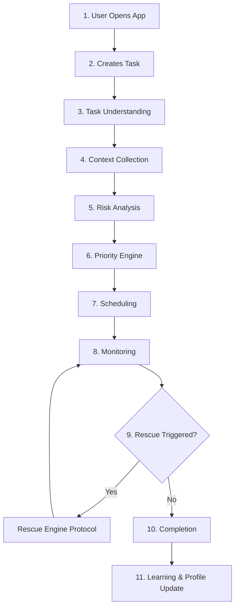

# ForeSee Task Classification & Risk Engine Specification
### *Productivity Intelligence Graph & Adaptive Scheduling Blueprint*

---

## Chapter 1: Task Lifecycle

The lifecycle of a task in ForeSee represents a continuous feedback loop that spans from user intent capture to retrospective machine learning. Every task progresses through eleven distinct phases:



### Detailed Lifecycle Phases

1. **User Opens App (Initiation)**: The app initializes. It loads the cached user profile and subscribes to real-time updates for active tasks and calendar events from Firestore. The context window updates with the current time, location, and device status.
2. **Creates Task (Capture)**: The user captures a task using natural language input or the structured task modal. Natural language input is captured via text or voice.
3. **Task Understanding (LLM Extraction)**: The task creation event triggers an LLM (Gemini 2.5 Flash). The agent extracts task attributes (e.g. title, hours, difficulty, deadline, dependencies) and assigns initial confidence values.
4. **Context Collection (State Aggregation)**: The system queries the user's Google Calendar and Firestore database to collect context:
   - Existing appointments, meetings, and locked time blocks.
   - Total workload currently scheduled for the remaining time window.
   - Historical task data (e.g. average completion rate for coding tasks).
   - User state variables (e.g. current sleep levels, stress indicators, procrastination score).
5. **Risk Analysis (Scoring)**: The Risk Scorer calculates the task's probability of failure using the weighted multi-factor formula. This produces an initial risk percentage and assigns a level (`safe`, `monitor`, `danger`, `critical`).
6. **Priority Engine (Multi-Dimension Mapping)**: The priority engine goes beyond 1D priority ("High"). It maps the task across multiple independent vectors (Urgency, Importance, Dependency, Execution Style).
7. **Scheduling (Calendar Synthesis)**: The Smart Scheduler places the task (or its split sessions) into optimal focus-aware time slots. It locks calendars where deadlines are fixed and flags potential overbookings.
8. **Monitoring (Behavioral Watchdogs)**: As time passes, the system monitors progress. It tracks checked-off subtasks, missed check-ins, time-decay, and external calendar changes.
9. **Rescue (Intervention)**: If a watchdog triggers a risk increase to `critical`, the Rescue Engine is activated. It halts normal scheduling, compiles rescue options with trade-offs, and presents them to the user.
10. **Completion (Attainment)**: The user marks the task as complete. The system logs the actual time spent, actual duration, completion time vs. deadline, and number of subtasks checked off.
11. **Learning & Profile Update (Feedback Loop)**: The self-learning module compares the initial estimate (e.g., "5 hours, low difficulty") with actual execution metrics. It updates the user's profile variables (e.g., "estimates writing tasks 15% too low") and refines the task-switching and delay coefficient weights.

---

## Chapter 2: Task Creation Fields & Metadata

To fuel a predictive scheduling engine, tasks must carry dense metadata. Below is the list of fields collected during task creation and the rationale for their existence.

### Field Definitions & Rationale

| Field Group | Field Name | Type | Options / Formats | Scheduling Impact & Rationale |
| :--- | :--- | :--- | :--- | :--- |
| **Core** | Title | String | Free Text | Parsed by LLM to find semantic similarities with past completed tasks. |
| **Core** | Expected Hours | Float | $0.1 - 100.0$ | Defines the raw calendar duration needed. Used to calculate workload capacity gaps. |
| **Core** | Difficulty | Enum | Easy, Medium, Hard, Very Hard | Multiplies expected hours by a safety factor (e.g. Hard = 1.25x buffer) for less reliable profiles. |
| **Core** | Deadline Date | Date | YYYY-MM-DD | Sets the absolute hard boundary for the task. |
| **Core** | Deadline Time | Time | HH:MM | Sets the exact minute the task is due. Used to calculate remaining hours. |
| **Core** | Importance | Boolean | True, False | Flags if a task is user-declared important. Affects the default priority weight. |
| **Metadata** | Task Category | Enum | Assignment, Coding, Meeting, Exam, Personal, Finance, etc. | Determines category-specific completion bias and default energy requirements. |
| **Metadata** | Task Type | Enum | Fixed Deadline, Flexible, Recurring, Milestone, Dependency, Habit | Governs scheduling flexibility (e.g., a "Meeting" is locked, "Flexible" can be deferred). |
| **Execution** | Execution Style | Enum | Single Session, Multi-Session, Parallel, Sequential | Determines whether the task must be completed in one block or can be split into chunks (e.g., pomodoros). |
| **Focus** | Energy Requirement | Enum | Very Low, Low, Medium, High, Peak Focus | Schedules tasks in slots matching user energy levels (e.g. Peak Focus tasks placed in the morning). |
| **Focus** | Interruption Tolerance | Enum | Interruptible, Semi-Interruptible, Deep Work Only | Governs scheduling environment (e.g. Deep Work Only blocks out Slack notifications). |
| **Confidence** | Estimated Confidence | Integer | 20%, 40%, 60%, 80%, 100% | Dictates safety margin. Lower confidence triggers automated subtask breakdowns. |
| **Psychological**| Motivation Level | Enum | Very Excited, Neutral, Avoiding, Burned Out, Forced | High avoidance tasks are scheduled early with accountability check-ins. |
| **Constraints** | Requires Internet | Boolean | True, False | Schedules tasks only if connectivity is available (supports offline queue). |
| **Constraints** | Device Constraints | Enum | Laptop, Office, Travel, Team, Manager Approval | Overlays calendar slots with location and resource availability. |

---

## Chapter 3: Onboarding & Profile Variables

A user's profile is the core template for their scheduling constraints. ForeSee builds a **Productivity Fingerprint** using onboarding variables that adapt over time.

### Profiling Variable Catalog

*   **Working Style**:
    *   *Morning Person*: Primary deep-work capacity placed between 07:00 and 12:00.
    *   *Night Owl*: Primary deep-work capacity placed between 20:00 and 02:00.
    *   *Balanced*: Dual peaks (e.g., 09:30–12:00 and 14:30–17:00).
*   **Peak Focus Window**: Standard hours representing peak performance (e.g. `["09:00-12:00", "15:00-17:00"]`).
*   **Preferred Session Length**: Default block duration for task execution (e.g. `25` min, `45` min, `90` min).
*   **Maximum Daily Deep Work**: Ceiling of high-focus hours per day (default `4.0` hours).
*   **Maximum Total Work**: Total hours of work (deep + shallow) allowed daily (default `8.0` hours).
*   **Weekend Availability**: Boolean flag. If true, allows scheduling rescue sessions on Saturdays and Sundays.
*   **Lunch Break Window**: Time-range locked from task scheduling (default `13:00-14:00`).
*   **Meeting Heavy**: Boolean indicating if calendar contains dense administrative appointments.
*   **Average Sleep**: Estimated sleep in hours. Low sleep (< 6.5h) temporarily downgrades daily deep-work capacity.
*   **Procrastination Level**: Self-reported index ($1$ to $5$). Multiplies initial check-in frequencies.
*   **Stress Level**: Baseline stress indicator. High stress prompts wider buffers and adaptive scope compression.
*   **Calendar Strictness**: Percentage of times user sticks to scheduled events. Low strictness increases buffer requirements.
*   **Context Switching Cost**: Minutes needed to refocus after switching task categories (default `15` mins).
*   **Break Frequency**: Preferred time between focus blocks (e.g., 10 mins every 50 mins).
*   **Focus Recovery Time**: Time required to restore focus after a distraction (defaults to 20 minutes).

---

## Chapter 4: Firebase Firestore Data Model

The Firestore database leverages a nested subcollection architecture centered on the `users` collection to align with security constraints.

```
/users (Collection)
   └─ {userId} (Document)
         ├─ profiles (Subcollection) -> default (Document)
         ├─ tasks (Subcollection) -> {taskId} (Document)
         ├─ subtasks (Subcollection) -> {subtaskId} (Document)
         ├─ riskScores (Subcollection) -> {scoreId} (Document)
         ├─ rescuePlans (Subcollection) -> {planId} (Document)
         ├─ simulations (Subcollection) -> {simId} (Document)
         ├─ calendarMappings (Subcollection) -> {mapId} (Document)
         ├─ notifications (Subcollection) -> {notifId} (Document)
         ├─ learning (Subcollection) -> {learningId} (Document)
         ├─ history (Subcollection) -> {historyId} (Document)
         └─ agentLogs (Subcollection) -> {logId} (Document)
```

### Document Schemas

#### 1. User Document (`/users/{userId}`)
```typescript
interface UserDocument {
  uid: string;
  email: string;
  photoURL?: string;
  name: string;
  username: string;
  createdAt: string;
  updatedAt: string;
}
```

#### 2. Profile Document (`/users/{userId}/profiles/default`)
```typescript
interface ProfileDocument {
  preferences: {
    profession: 'developer' | 'designer' | 'manager' | 'student' | 'writer' | 'other';
    workStart: string; // "HH:MM"
    workEnd: string; // "HH:MM"
    deepWorkHours: number;
    workingStyle: 'morning' | 'night' | 'balanced';
    peakFocusWindow: string[]; // ["09:00-11:30", "15:00-17:00"]
    preferredSessionLength: number; // minutes
    maxDailyDeepWork: number; // hours
    maxTotalWork: number; // hours
    weekendAvailability: boolean;
    lunchStart: string; // "HH:MM"
    lunchEnd: string; // "HH:MM"
    meetingHeavy: boolean;
    notificationPreference: 'high' | 'medium' | 'low';
    calendarStrictness: number; // 0.0 - 1.0
  };
  metrics: {
    averageCompletionRate: number; // 0.0 - 1.0
    averageDelayHours: number;
    deepWorkCapacity: number; // hours
    burnoutScore: number; // 0 - 100
    reliabilityScore: number; // 0 - 100
    focusScore: number; // 0 - 100
    planningAccuracy: number; // 0.0 - 1.0
    contextSwitchingCost: number; // minutes
    procrastinationIndex: number; // 1 - 5
    focusRecoveryTime: number; // minutes
  };
}
```

#### 3. Task Document (`/users/{userId}/tasks/{taskId}`)
```typescript
interface TaskDocument {
  taskId: string;
  userId: string;
  title: string;
  description?: string;
  category: 'Assignment' | 'Meeting' | 'Coding' | 'Research' | 'Exam' | 'Interview' | 'Presentation' | 'Documentation' | 'Personal' | 'Finance' | 'Health' | 'Bills' | 'Travel' | 'Learning' | 'Workout' | 'Family' | 'Other';
  taskType: 'fixed_deadline' | 'flexible' | 'recurring' | 'milestone' | 'dependent' | 'goal' | 'habit' | 'calendar_event';
  executionStyle: 'single_session' | 'multi_session' | 'parallel' | 'sequential';
  energyRequirement: 'very_low' | 'low' | 'medium' | 'high' | 'peak';
  interruptionTolerance: 'interruptible' | 'semi' | 'deep_work_only';
  estimatedConfidence: number; // 20, 40, 60, 80, 100
  motivationLevel: 'excited' | 'neutral' | 'avoiding' | 'burned_out' | 'forced';
  requiresInternet: boolean;
  requirements: string[]; // ["laptop", "office", "travel", "team"]
  deadline: string; // ISO string
  estimatedHours: number;
  actualHours?: number;
  isImportant: boolean;
  progress: number; // 0 - 100
  riskScore: number; // 0 - 100
  riskLevel: 'safe' | 'monitor' | 'danger' | 'critical';
  riskTrend: 'up' | 'down' | 'stable';
  completionProbability: number; // 0.0 - 1.0
  dependencies: string[]; // taskId array
  createdAt: string;
  updatedAt: string;
  lastActivity: string;
  rescueCount: number;
  planStabilityIndex: number; // 0 - 100
  behaviorScore: number; // 0 - 100
}
```

#### 4. Subtask Document (`/users/{userId}/subtasks/{subtaskId}`)
```typescript
interface SubtaskDocument {
  subtaskId: string;
  taskId: string;
  title: string;
  estimatedHours: number;
  isCompleted: boolean;
  order: number;
  completedAt?: string;
}
```

#### 5. Risk Score Log (`/users/{userId}/riskScores/{scoreId}`)
```typescript
interface RiskScoreDocument {
  taskId: string;
  timestamp: string; // ISO
  riskScore: number;
  riskFactors: {
    timePressure: number;
    workloadGap: number;
    deadlineDistance: number;
    complexityMultiplier: number;
    historicalDelayModifier: number;
    procrastinationImpact: number;
    calendarConflictImpact: number;
    dependencyDelayImpact: number;
  };
  weights: Record<string, number>;
  probability: number;
  classification: string;
  trend: 'up' | 'down' | 'stable';
  confidence: number;
}
```

#### 6. Rescue Plan (`/users/{userId}/rescuePlans/{planId}`)
```typescript
interface RescuePlanDocument {
  planId: string;
  taskId: string;
  timestamp: string;
  status: 'pending' | 'accepted' | 'declined' | 'completed';
  strategies: Array<{
    name: string; // "Focused Sprint" | "Scope Compression" | "Emergency Rescue" | "Split Sessions"
    description: string;
    predictedSuccessProbability: number;
    dailyWorkSchedule: Array<{ date: string; hours: number }>;
    requiredEffortIncreasePercent: number;
    tradeOffs: string[];
    confidenceScore: number;
    estimatedStressImpact: 'low' | 'medium' | 'high';
    expectedCompletionDate: string;
    finalRecommendation: boolean;
  }>;
}
```

---

## Chapter 5: Multi-Dimensional Task Classification Logic

ForeSee structures the task layout through a multi-dimensional state matrix, replacing single-dimensional variables:

```
┌────────────────────────────────────────────────────────┐
│               Task Classification Matrix               │
├─────────────────┬──────────────────────────────────────┤
│ Dimension       │ States / Classifications             │
├─────────────────┼──────────────────────────────────────┤
│ Urgency         │ Critical • Urgent • Soon • Future    │
│ Importance      │ Mission-Critical • High • Med • Low  │
│ Difficulty      │ Easy • Medium • Hard • Very Hard     │
│ Risk            │ Safe • Monitor • Danger • Critical   │
│ Planning State  │ Unplanned • Partial • Fully Planned  │
│ Behavior State  │ On Track • Slipping • Stalled •      │
│                 │ Blocked • Recovering                 │
│ Calendar State  │ Scheduled • Conflicting •            │
│                 │ Unscheduled • Overbooked             │
│ Dependency State│ Waiting • Ready • Blocked            │
│ Progress State  │ Not Started • Started • Half Done •  │
│                 │ Almost Done • Done                   │
└─────────────────┴──────────────────────────────────────┘
```

### State Definitions & Transition Criteria

1.  **Urgency**:
    *   *Critical*: Time until deadline $t_{rem} \le 1.2 \times \text{Remaining Hours}$. Immediate slot allocation required.
    *   *Urgent*: $t_{rem} \le 3.0 \times \text{Remaining Hours}$. Schedules within 24 hours.
    *   *Soon*: $t_{rem} \le 7.0 \times \text{Remaining Hours}$. Scheduled within the current week.
    *   *Future*: $t_{rem} > 7.0 \times \text{Remaining Hours}$. Allowed to remain unscheduled or in low-density queues.
2.  **Importance**:
    *   *Mission-Critical*: User marked important + dependency anchor + high failure impact.
    *   *High*: User marked important or project milestone.
    *   *Medium*: Default project tasks.
    *   *Low*: Admin tasks, flexible deadlines, personal habits.
3.  **Difficulty**:
    *   *Easy*: Estimated hours $\le 1.0$h. No complex subtasks.
    *   *Medium*: $1.0$h $< \text{Hours} \le 4.0$h. Single focus session.
    *   *Hard*: $4.0$h $< \text{Hours} \le 10.0$h. Split focus sessions required.
    *   *Very Hard*: $\text{Hours} > 10.0$h. Multi-day milestone tracking, requires subtask tree.
4.  **Risk**:
    *   *Safe*: Calculated Risk Score $< 30$.
    *   *Monitor*: $30 \le \text{Risk Score} < 60$.
    *   *Danger*: $60 \le \text{Risk Score} < 85$.
    *   *Critical*: $\text{Risk Score} \ge 85$. Activates the Rescue Engine.
5.  **Planning State**:
    *   *Unplanned*: Task exists but has no calendar slot allocated.
    *   *Partially Planned*: Task hours exceed calendar block allocations.
    *   *Fully Planned*: Calendar blocks $\ge$ remaining hours needed.
6.  **Behavior State**:
    *   *On Track*: User completing subtasks on time, calendar blocks checked off.
    *   *Slipping*: Calendar blocks missed but deadline buffer remains $> 1.5$.
    *   *Stalled*: No subtask activity for $> 48$ hours on an urgent task.
    *   *Blocked*: Open dependency task remains uncompleted.
    *   *Recovering*: Accepted a rescue plan and successfully met first check-in milestones.
7.  **Calendar State**:
    *   *Scheduled*: Calendar event exists with no overlaps.
    *   *Conflicting*: Event overlaps with another task or calendar meeting.
    *   *Unscheduled*: No blocks allocated for the task.
    *   *Overbooked*: Allocated blocks occur in a day where total work exceeds `maxTotalWork`.
8.  **Dependency State**:
    *   *Waiting*: Pre-requisite tasks are still in progress.
    *   *Ready*: Pre-requisites completed; task is clear to start.
    *   *Blocked*: Deadline of a pre-requisite has passed and is uncompleted.
9.  **Progress State**:
    *   *Not Started*: $0\%$ completion.
    *   *Started*: $1\% - 25\%$ progress.
    *   *Half Done*: $26\% - 75\%$ progress.
    *   *Almost Done*: $76\% - 99\%$ progress.
    *   *Done*: $100\%$ progress.

---

## Chapter 6: Risk Score Variables & Mathematical Features

ForeSee's Task Classification and Risk Engine tracks over 30 variables categorized into key groupings to compute failure probability.

### Risk Variable breakdown

*   **Time-Based Variables**:
    *   *Deadline Distance*: Duration remaining until deadline (in hours).
    *   *Remaining Effort*: Estimated remaining hours needed ($E_{rem} = \text{Estimated Hours} \times (1 - \text{Progress}/100)$).
    *   *Task Age*: Elapsed time since task creation. Tracks stalling.
    *   *Last Activity*: Hours since user last updated or completed a subtask.
*   **Capacity-Based Variables**:
    *   *Workload Gap*: The difference between remaining effort and available calendar hours in user's profile focus windows before the deadline.
    *   *Calendar Availability*: Total unallocated hours within focus windows.
    *   *Upcoming Meetings*: Count and duration of calendar meetings that chip away at focus slots.
    *   *Current Queue Length*: Total active tasks in the same priority category.
*   **Behavioral Variables**:
    *   *Historical Delay Modifier*: User's average late duration (in hours) on similar tasks.
    *   *Reliability Score*: Rate of completion of scheduled blocks ($0.0 - 1.0$).
    *   *Procrastination Index*: Onboarding variable ($1-5$), mapped to historical delay.
    *   *Missed Check-ins*: Number of daily check-in prompts ignored or deferred.
*   **Execution Variables**:
    *   *Task Complexity*: Number of subtasks + number of external dependencies.
    *   *Energy Match*: Deviation between task's energy requirement and the energy level typical of scheduled calendar hours.
    *   *Focus Window Match*: Percentage of task hours scheduled inside user's peak focus windows.
    *   *Context Switching Cost*: Penalty hours added if task is scheduled adjacent to tasks of different categories.
*   **Health & Stress Variables**:
    *   *Sleep Quality*: 0.0 - 1.0 modifier based on user onboarding sleep average.
    *   *Burnout Index*: Tracked as consecutive high-effort days. Modulates recovery thresholds.
*   **Machine Learning Variables**:
    *   *AI Confidence*: Gemini agent extraction confidence index (0.0 - 1.0).
    *   *Historical Similarity*: Correlation score to completed tasks matching this category.

---

## Chapter 7: The ForeSee Unified Risk Formula

The Risk Score calculation combines time, capacity, behavior, health, and complexity factors into a single score.

### Mathematical Definition

$$RiskScore = \text{Clamp}\left( W_T \cdot X_T + W_C \cdot X_C + W_B \cdot X_B + W_D \cdot X_D + W_H \cdot X_H, 0, 100 \right)$$

Where:
*   $X_T$: **Time Pressure Score**
*   $X_C$: **Workload Capacity Deficit**
*   $X_B$: **User Behavior Modifier**
*   $X_D$: **Dependency Risk**
*   $X_H$: **Burnout/Health Modifier**
*   $W_T, W_C, W_B, W_D, W_H$: **Weights** ($W_T + W_C + W_B + W_D + W_H = 1.0$)

---

### Variable Normalization and Calculations

#### 1. Time Pressure ($X_T$)
Measures deadline proximity relative to remaining effort.
$$X_T = \text{Clamp}\left( \frac{E_{rem}}{t_{rem}} \times 100, 0, 100 \right)$$
*   If $t_{rem} \le 0$, then $X_T = 100$ (deadline passed).
*   $E_{rem}$: Remaining effort (estimated hours $\times (1 - \text{progress})$).
*   $t_{rem}$: Remaining hours until deadline.

#### 2. Workload Capacity Deficit ($X_C$)
Compares needed hours against user calendar availability.
$$X_C = \text{Clamp}\left( \frac{E_{rem} - A_{avail}}{E_{rem} + 1} \times 100, 0, 100 \right)$$
*   $A_{avail}$: Sum of available focus hours in user's profile before the deadline.
*   If $A_{avail} \ge E_{rem}$, then $X_C = 0$.

#### 3. User Behavior Modifier ($X_B$)
Incorporates historical execution reliability.
$$X_B = \left( (1 - \text{Reliability}) \times 40 \right) + \left( \text{ProcrastinationIndex} \times 12 \right)$$
*   $\text{Reliability}$: User completion rate of focus blocks (defaults to onboarding estimation).
*   $\text{ProcrastinationIndex}$: Scale of 1 to 5.
*   $X_B$ is capped at $100$.

#### 4. Dependency Risk ($X_D$)
Reflects delays in prerequisite tasks.
$$X_D = \max_{d \in \text{Deps}} \left( RiskScore(d) \times \text{Urg}(d) \right)$$
*   If no dependencies exist, then $X_D = 0$.

#### 5. Burnout/Health Modifier ($X_H$)
Accounts for cognitive depletion.
$$X_H = (100 - \text{SleepQuality} \times 100) \times 0.4 + \text{BurnoutIndex} \times 0.6$$

---

### Weight Adaptation Protocol

*   **Initial Baseline (Onboarding)**: Base weights set to:
    *   $W_T = 0.35$ (Time Pressure)
    *   $W_C = 0.30$ (Capacity)
    *   $W_B = 0.20$ (Behavior)
    *   $W_D = 0.10$ (Dependencies)
    *   $W_H = 0.05$ (Burnout)
*   **Adaptive Tuning Loop (Self-Learning)**: Every completed task compares predicted risk curves with reality.
    *   If user consistently completes high-risk tasks without delay, decrease behavior weight $W_B$ and increase time weight $W_T$ (trusting the math, lowering user bias).
    *   If user consistently delays tasks even with low time pressure, increase behavior weight $W_B$ by $+0.05$ per late task, dynamically tuning the formula to personal procrastination habits.

---

## Chapter 8: Task Categories Permutations

Task categories represent different execution behaviors. Here is how different permutations affect scheduling constraints and risk scoring:

### 1. Assignment (Academic/Due Date Heavy)
*   **Attributes**: Fixed deadline, high procrastination factor, multiple sessions.
*   **State Mapping**: Often transitions from *Future (Safe)* to *Urgent (Danger)* rapidly due to workload gap calculations.
*   **Scheduling Constraint**: Blocks out study sessions in 45-minute increments; schedules writing blocks 3 days before deadline.

### 2. Coding Project
*   **Attributes**: Deep work requirement, hard difficulty, sequential execution style.
*   **State Mapping**: Requires high-focus windows. High context switching costs ($18\%$ estimation penalty on coding tasks).
*   **Scheduling Constraint**: Restricted to slots $> 90$ mins. Block notification popups completely during execution.

### 3. Bills / Finance
*   **Attributes**: Fixed deadline, low energy requirement, single session.
*   **State Mapping**: High penalty for failure. Importance is set to *High* automatically.
*   **Scheduling Constraint**: Placed in shallow work slots (e.g. late afternoons or post-work hours).

### 4. Health / Medication
*   **Attributes**: Flexible/Recurring task types, health category.
*   **State Mapping**: Critical priority, but low cognitive energy.
*   **Scheduling Constraint**: Fixed recurring calendar alarms that bypass default calendar boundaries.

---

## Chapter 9: Edge Cases & Resolution Logic

A system that handles real lives must expect exceptions. Below is the decision logic for specific edge cases:

```
┌─────────────────────────────────┬────────────────────────────────────────┐
│ Edge Case                       │ Resolution Logic                       │
├─────────────────────────────────┼────────────────────────────────────────┤
│ 1. Impossible Task              │ If expected hours > remaining hours:   │
│                                 │ Trigger Rescue Engine IMMEDIATELY.     │
│ 2. Passed Deadline              │ Mark as "Missed", trigger recovery     │
│                                 │ workflow, and decrement Reliability.   │
│ 3. Bulk Task Dump (30+ tasks)   │ Recalculate daily load, trigger group  │
│                                 │ prioritization flow.                   │
│ 4. External Calendar Change     │ Detect event intersection, recalculate │
│                                 │ availability, update risk.             │
│ 5. Duplicate Tasks              │ Run semantic similarity check; prompt  │
│                                 │ user: "Merge with existing?"           │
└─────────────────────────────────┴────────────────────────────────────────┘
```

### Detailed Decision Tables

*   **Impossible Tasks**:
    *   *Trigger*: Task created with $E_{rem} > t_{rem}$ (e.g. 10 hours required, deadline in 6 hours) or $E_{rem} > A_{avail}$.
    *   *Action*: Prevent default scheduling. Flag task risk immediately as $99$ (Critical). Prompt: *"This task cannot be fit into your schedule. Let's look at rescue options."*
*   **Passed Deadlines**:
    *   *Trigger*: System time crosses deadline and task progress $< 100\%$.
    *   *Action*: Convert Task state to `Missed`. Archive calendar blocks. Trigger *Late Completion Recovery Wizard* asking for new deadline or deferral confirmation. Decrement user's Reliability Score by $2.5\%$.
*   **Bulk Task Dumps**:
    *   *Trigger*: $> 10$ tasks added within 10 minutes.
    *   *Action*: Halt immediate scheduler runs. Run batch categorization. Prompt user with a triage layout: *"You added 12 tasks. Let's group them into priorities so we don't overbook your week."*
*   **External Calendar Conflicts**:
    *   *Trigger*: User updates Google Calendar manually, adding a 3-hour meeting overlapping task blocks.
    *   *Action*: The webhook listener notifies Firestore. The Scheduler identifies overlapping blocks, marks task state as `Conflicting`, recalculates $A_{avail}$, updates Risk Score, and pushes remaining blocks to the next available focus windows.

---

## Chapter 10: The Rescue Engine

The Rescue Engine is the key safety net of the ForeSee platform, activating automatically when any task enters the `critical` risk level (Risk Score $\ge 85$).

```
                ┌───────────────────────────┐
                │    Task Risk Score >= 85  │
                └─────────────┬─────────────┘
                              │
                    [Activate Rescue]
                              │
            ┌─────────────────┴─────────────────┐
            ▼                                   ▼
   [Evaluate Context]                  [Select Strategies]
   - Remaining Effort                  - Focused Sprint
   - Focus capacity                    - Scope Compression
   - User reliability                  - Emergency Mode
   - Dependencies                      - Splitting Chunks
            │                                   │
            └─────────────────┬─────────────────┘
                              │
                              ▼
                 ┌─────────────────────────┐
                 │ Generate Rescue Plans   │
                 │ - Probabilities         │
                 │ - Stress Impacts        │
                 │ - Effort Deltas         │
                 └────────────┬────────────┘
                              │
                     [Present Options]
                              │
            ┌─────────────────┴─────────────────┐
            ▼                                   ▼
       [User Accepts]                    [User Declines]
            │                                   │
   - Reschedule Blocks                 - Log Decision
   - Write Google Calendar             - Escalate Check-ins
   - Set State: "Recovering"           - Maintain high risk
```

### Evaluation Protocol
The Rescue Engine gathers user parameters:
1.  **Remaining Effort & Capacity**: How many hours are needed vs. how many focus hours exist before deadline.
2.  **Plan Stability Index (PSI)**: How often the user has rescheduled this task previously. High stability index prioritizes scope compression over rescheduling.
3.  **User Preferences (Weekend/Evening)**: Checks profile if work is permitted on weekends or outside workStart/workEnd.

### Strategy Library

#### 1. Focused Sprint
*   **Mechanism**: Postpones all tasks with Importance $<$ High. Claims free calendar slots. Inserts two 70-to-90 minute deep-work blocks.
*   **Trade-off**: Lower-priority tasks slip by $1-2$ days.
*   **Expected Success Probability Boost**: $+25\%$ to $+40\%$.

#### 2. Scope Compression
*   **Mechanism**: Uses LLM agent to analyze task description and subtasks. Identifies optional subtasks (e.g. "writing appendix", "extra styling") and marks them as deferred. Cuts expected effort hours by $30\%$.
*   **Trade-off**: Shipped project contains core deliverables only.
*   **Expected Success Probability Boost**: $+35\%$.

#### 3. Emergency Mode
*   **Mechanism**: Activates when deadline is $< 12$ hours away. Locks the calendar completely. Schedules continuous focus sessions. Emails the user's accountability contact. Sends notifications every 30 minutes.
*   **Trade-off**: High stress impact. Bypasses normal sleep and weekend restrictions.
*   **Expected Success Probability Boost**: $+50\%$.

#### 4. Splitting Chunks (Micro-actions)
*   **Mechanism**: Splits a large task into smaller 25-minute pomodoro chunks scheduled sequentially. Reduces cognitive friction for high-avoidance tasks.
*   **Trade-off**: More context switching events.
*   **Expected Success Probability Boost**: $+15\%$.

### Dynamic Output Structure
For every rescue plan, the engine calculates:
*   **Daily Work Schedule**: Exact date/hour blocks allocated.
*   **Effort Increase**: Percentage change in daily focus time.
*   **Stress Impact**: Categorized as `low`, `medium`, or `high`.
*   **Calendar Actions**: Array of virtual Google Calendar updates. When accepted, these events are written to the user's primary calendar account.
